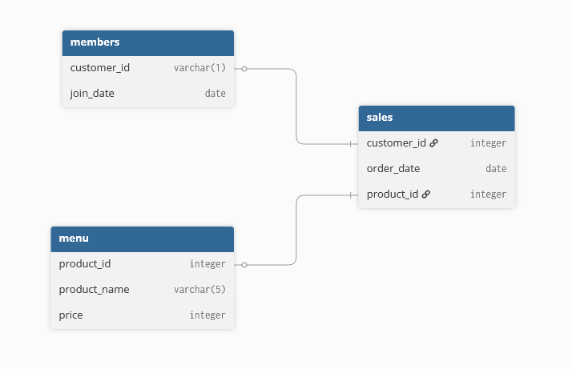

<div align="center">

# Case Study #1 - Danny's Diner </br>


</div>

## 📋 Spis treści

- [Opis](#opis)
- [Diagram relacji](#diagram-relacji)
- [Rozwiązanie zapytań](#rozwiązanie-zapytań)
  - [1. What is the total amount each customer spent at the restaurant?](#1-what-is-the-total-amount-each-customer-spent-at-the-restaurant)
  - [2. How many days has each customer visited the restaurant?](#2-how-many-days-has-each-customer-visited-the-restaurant)
  - [3. What was the first item from the menu purchased by each customer?](#3-what-was-the-first-item-from-the-menu-purchased-by-each-customer)
  - [4. What is the most purchased item on the menu and how many times was it purchased by all customers?](#4-what-is-the-most-purchased-item-on-the-menu-and-how-many-times-was-it-purchased-by-all-customers)
  - [5. Which item was the most popular for each customer?](#5-which-item-was-the-most-popular-for-each-customer)
  - [6. Which item was purchased first by the customer after they became a member?](#6-which-item-was-purchased-first-by-the-customer-after-they-became-a-member)
  - [7. Which item was purchased just before the customer became a member?](#7-which-item-was-purchased-just-before-the-customer-became-a-member)
  - [8. What is the total items and amount spent for each member before they became a member?](#8-what-is-the-total-items-and-amount-spent-for-each-member-before-they-became-a-member)
  - [9. If each $1 spent equates to 10 points and sushi has a 2x points multiplier - how many points would each customer have?](#9-if-each-1-spent-equates-to-10-points-and-sushi-has-a-2x-points-multiplier---how-many-points-would-each-customer-have)
  - [10. In the first week after a customer joins the program (including their join date) they earn 2x points on all items, not just sushi - how many points do customer A and B have at the end of January?](#10-in-the-first-week-after-a-customer-joins-the-program-including-their-join-date-they-earn-2x-points-on-all-items-not-just-sushi---how-many-points-do-customer-a-and-b-have-at-the-end-of-january)
- [Pytania bonusowe](#pytania-dodatkowe)
  - [1. Join All The Things](#join-all-the-things)
  - [2. Rank All The Things](#rank-all-the-things)

## 🔍 Opis

### Wprowadzenie

Danny w 2021 roku postanawia otworzyć japońską restaurację, która sprzedaje 3 potrawy: sushi, curry oraz ramen. Restauracja przechwyciła kilka podstawowych danych, ale nie wie, jak je wykorzystać.

### Problem

Danny chce wykorzystać dane, aby odpowiedzieć na kilka prostych pytań dotyczących swoich klientów, aby polepszyć stosunki ze stałymi klientami oraz zapewnić im lepsze doświadczenia z jedzeniem.

Informacje te chce wykorzystać, aby podjąć kilka decyzji biznesowych jak chociażby rozszerzenie programu lojalnościowego.

## 📈 Diagram relacji

Przez wzgląd na zachowanie poufności Danny dostarczył próbkę ogólnych danych o swoich klientach i zamówieniach.

Udostępnił 3 kluczowe zbiory danych: sales, menu oraz members.

<div align=center>

</div>

## ⚙️ Rozwiązanie zapytań

### 1. What is the total amount each customer spent at the restaurant?

_Jaka była całkowita kwota, jaką każdy klient wydał w restauracji?_

```sql
SELECT
    sales.customer_id AS customer,
    SUM(menu.price) AS total_amount
FROM sales
INNER JOIN menu
    ON sales.product_id = menu.product_id
GROUP BY customer
ORDER BY customer;
```

#### Proces:

- połączone zostały tabele "sales" oraz "menu"
- za pomocą funkcji SUM() zsumowano koszt dla każdego klienta
- wynik został pogrupowany według ID klienta

#### Wynik zapytania/Odpowiedź:

| customer | total_amount |
| :------: | :----------: |
|    A     |      76      |
|    B     |      74      |
|    C     |      36      |

---

### 2. How many days has each customer visited the restaurant?

_Przez ile dni każdy klient odwiedzał restaurację?_

```sql
SELECT
    sales.customer_id as customer,
    COUNT(DISTINCT sales.order_date) as count_date
FROM sales
GROUP BY customer
ORDER BY customer;
```

#### Proces:

- za pomocą DISTINCT wybierane są tylko unikatowe daty zamówienia
- funkcja COUNT() oblicza ile razy wystąpiła data
- wyniki pogrupowane zostały według klientów

#### Wynik zapytania/Odpowiedź:

| customer | count_date |
| :------: | :--------: |
|    A     |     4      |
|    B     |     6      |
|    C     |     2      |

---

### 3. What was the first item from the menu purchased by each customer?

_Co było pierwszą pozycją z menu zakupioną przez każdego klienta?_

```sql
WITH rank_sales AS(
    SELECT
        sales.customer_id as customer,
        sales.order_date as order_date,
        menu.product_name as product,
        DENSE_RANK() OVER
            (PARTITION BY customer_id
            ORDER BY  order_date) as rank_item
    FROM sales
    INNER JOIN menu
        ON menu.product_id = sales.product_id
)

SELECT
    customer,
    product
FROM rank_sales
WHERE rank_item = 1
GROUP BY customer, product
ORDER BY customer;
```

#### Proces:

- stworzone zostało CTE (ang. Common Table Expression), w którym zastosowano funkcję DENSE_RANK(), która numeruje kolejne wiersze patrząc na datę zamówienia (powtarzajace się wartości moją ten sam numer), a dzięki PARTITION BY dane zostały dodatkowo pogrupowane według klientów
- w głównym zapytaniu ustawiono warunek rank_item, aby wyświetlić tylko pierwsze zamówienia

#### Wynik zapytania/Odpowiedź:

| customer | product |
| :------: | :-----: |
|    A     |  curry  |
|    A     |  sushi  |
|    B     |  curry  |
|    C     |  ramen  |

#### Wytłumaczenie:

Zastosowano funkcję DENSE_RANK() zamiast ROW_NUMBER(), ponieważ istniała możliwość - i taka właśnie się pojawiła - że będą wartości posiadające tę samą datę. Niestety dokładny czas zamówienia nie jest podany, więc aby zapewnić wiarygodność danych dla klienta A zostały podane obie opcje, ponieważ nie wiadomo, co pierwsze zostało zamówione.

---

### 4. What is the most purchased item on the menu and how many times was it purchased by all customers?

_Która pozycja w menu jest najczęściej kupowana i ile razy została kupiona przez klientów?_

```sql
SELECT
    menu.product_name as product,
    COUNT(sales.product_id) as count_product
FROM menu
INNER JOIN sales
    ON menu.product_id = sales.product_id
GROUP BY product
ORDER BY count_product DESC
LIMIT 1;
```

#### Proces:

- połączone zostały tablice menu oraz sales
- za pomogą agregacji policzono liczbę zamówień każdego dania
- wyniki uporządkowano malejąco i za pomocą LIMIT wybrano wartość najwyższą

#### Wynik zapytania/Odpowiedź:

| product | count_product |
| :-----: | :-----------: |
|  ramen  |       8       |

---

### 5. Which item was the most popular for each customer?

_Który produkt był najpopularniejszy dla każdego klienta?_

```sql
WITH popular_product AS(
    SELECT
        sales.customer_id as customer,
        COUNT(sales.product_id) as count_product,
        menu.product_name as product_name,
        DENSE_RANK() OVER
            (PARTITION BY customer_id
            ORDER BY COUNT(sales.product_id) DESC) as rank_item
    FROM sales
    INNER JOIN menu
        ON sales.product_id = menu.product_id
    GROUP BY customer_id, product_name
    ORDER BY customer_id
)

SELECT
    customer,
    product_name,
    count_product
FROM popular_product
WHERE rank_item = 1
```

#### Proces:

- stworzono CTE, który dla każdego klienta z osobna zwraca ranking najczęściej zamawianych dań (COUNT() oraz DENSE_RANK())
- aby wziąć najczęściej wybierane przez danego klienta zastosowano klauzulę WHERE

#### Wynik zapytania/Odpowiedź:

| customer | product_name | count_product |
| :------: | :----------: | :-----------: |
|    A     |    ramen     |       3       |
|    B     |    sushi     |       2       |
|    B     |    curry     |       2       |
|    B     |    ramen     |       2       |
|    C     |    ramen     |       3       |

---

### 6. Which item was purchased first by the customer after they became a member?

_Który produkt został zakupiony przez klienta jako pierwszy po zostaniu członkiem?_

```sql
WITH members_orders AS(
    SELECT
        sales.customer_id,
        sales.order_date,
        members.join_date,
        menu.product_name,
        DENSE_RANK() OVER
            (PARTITION BY sales.customer_id
            ORDER BY order_date) as rank_item
    FROM sales
    RIGHT JOIN members
        ON sales.customer_id = members.customer_id
    INNER JOIN menu
        ON sales.product_id = menu.product_id
    WHERE order_date >= join_date
)

SELECT
    customer_id,
    order_date,
    product_name
FROM members_orders
WHERE rank_item = 1;
```

#### Proces:

- w CTE połączono tablice sales, members oraz menu
- stworzony został ranking dla każdego klienta każdego produktu ze względu na datę zamówienia
- za pomocą klauzuli WHERE zostawiono tylko te zamówienia, które zostały złożone po zostaniu członkiem programu lojalnościowego
- w głównym zapytaniu wywołano jedynie najwyższy ranking, czyli pierwsze zamówienie

#### Wynik zapytania/Odpowiedź:

| customer_id | order_date | product_name |
| :---------: | :--------: | :----------: |
|      A      | 2021-01-07 |    curry     |
|      B      | 2021-01-11 |    sushi     |

#### Wytłumaczenie:

W CTE zastosowane zostało prawe połączenie tabel, czyli zostały wzięte wszystkie rekordy z tabeli members oraz pasujące do nich rekordy z tabeli sales. Wybrałam takie połączenie, ponieważ w zapytaniu chodziło jedynie o członków programu lojalnościowego, podczas gdy kliencie nie zawsze są uczestnikami, więc byliby niepotrzebni w tym zapytaniu.

---

### 7. Which item was purchased just before the customer became a member?

_Który produkt został kupiony tuż przed tym, jak klient został członkiem?_

```sql
WITH members_orders AS(
    SELECT
        sales.customer_id,
        sales.order_date,
        members.join_date,
        menu.product_name,
        DENSE_RANK() OVER
            (PARTITION BY sales.customer_id
            ORDER BY order_date) as rank_item
    FROM sales
    RIGHT JOIN members
        ON sales.customer_id = members.customer_id
    INNER JOIN menu
        ON sales.product_id = menu.product_id
    WHERE order_date < join_date
)

SELECT
    customer_id,
    order_date,
    product_name
FROM members_orders
WHERE rank_item = 1;
```

#### Proces:

- podobnie jak wcześniej w CTE połączono tabele w taki sam sposób, jedyną różnicą jest zmienienie warunku na zwrócenie tylko tych rekordów, w których data zamówienia jest mniejsza niż data dołączenia do programu

#### Wynik zapytania/Odpowiedź:

| customer_id | order_date | product_name |
| :---------: | :--------: | :----------: |
|      A      | 2021-01-01 |    sushi     |
|      A      | 2021-01-01 |    curry     |
|      B      | 2021-01-01 |    curry     |

#### Wytłumaczenie:

W odpowiedzi pojawił się dwa razy klienta A, jest to spowodowane tym, że dane zawierają jedynie ogólne daty zamówień (dzień, miesiac, rok), klient A w danym dniu zamówił dwa dania, więc nie jest możliwe wydedukować, które tak naprawdę było pierwsze, więc pozostawiono obydwa.</br>
W odpowiedzi nie ma klienta C, ponieważ pytanie brzmiało "przed zostaniem członkiem", więc w danych mieli się pojawić tylko aktualni członkowie programu.

---

### 8. What is the total items and amount spent for each member before they became a member?

_Jaka jest łączna liczba zakupionych produktów oraz kwota wydana przez każdego członka przed dołączeniem do programu członkowskiego?_

```sql
WITH before_members AS(
    SELECT
        sales.customer_id as customer,
        menu.price,
        sales.order_date,
        members.join_date
    FROM sales
    RIGHT JOIN members
        ON sales.customer_id = members.customer_id
    INNER JOIN menu
        ON sales.product_id = menu.product_id
    WHERE order_date < join_date
)

SELECT
    customer,
    COUNT(customer) as total_item,
    SUM(price) as total_price
FROM before_members
GROUP BY customer
ORDER BY customer;
```

#### Proces:

- CTE stworzone jak w poprzednim pytaniu, zwracające rekordy przed dołączeniem do programu
- w głównym zapytaniu zastosowano dwie funkcje agregujące COUNT(), która liczy liczbę zamówionych dań oraz SUM() liczącą całkowitą kwotę zamówionych dań

#### Wynik zapytania/Odpowiedź:

| customer | total_item | total_price |
| :------: | :--------: | :---------: |
|    A     |     2      |     25      |
|    B     |     3      |     40      |

---

### 9. If each $1 spent equates to 10 points and sushi has a 2x points multiplier - how many points would each customer have?

_Jeśli każdy wydany 1 dolar odpowiada 10 punktom, a sushi ma mnożnik punktów 2x – ile punktów miałby każdy klient?_

```sql
SELECT
    sales.customer_id,
    SUM(
        CASE
            WHEN menu.product_name = 'sushi' then menu.price * 20
            ELSE menu.price * 10
        END
    )as points
FROM sales
INNER JOIN menu
    ON sales.product_id = menu.product_id
GROUP BY customer_id
ORDER BY customer_id;
```

#### Proces:

- w zapytaniu użyto wyrażenia CASE, które zwraca różne wyniki w zależności od spełnionych warunków: pierwszym warunkiem jest sprawdzenie czy zamówionym daniem jest sushi, jeżeli tak to kwota jest mnożona razy 20 (2 \* 10), w drugim natomiast razy 10
- wyrażenie CASE zawarte jest w funkcji SUM(), która sumuje "kwotę" dań zamienioną na punkty za każde danie

#### Wynik zapytania/Odpowiedź:

| customer_id | points |
| :---------: | :----: |
|      A      |  860   |
|      B      |  940   |
|      C      |  360   |

---

### 10. In the first week after a customer joins the program (including their join date) they earn 2x points on all items, not just sushi - how many points do customer A and B have at the end of January?

_W pierwszym tygodniu po dołączeniu klienta do programu (wliczając dzień dołączenia) otrzymuje on 2x więcej punktów za wszystkie produkty, a nie tylko sushi – ile punktów mają klienci A i B na koniec stycznia?_

```sql
SELECT
    sales.customer_id,
    SUM(
        CASE
            WHEN sales.order_date BETWEEN members.join_date AND (members.join_date + 6) then menu.price * 20
            WHEN menu.product_name = 'sushi' then menu.price * 20
            ELSE menu.price * 10
        END
    )as points
FROM sales
INNER JOIN menu
    ON sales.product_id = menu.product_id
RIGHT JOIN members
    ON sales.customer_id = members.customer_id
WHERE sales.order_date <= '31.01.2021'
GROUP BY sales.customer_id
ORDER BY sales.customer_id;
```

#### Proces:

- w wyrażeniu CASE zastosowano dodatkowe warunki, tj. sprawdzenie jaka jest data zamówienia i czy mieści się ona w pierwszym tygodniu od dołączenia do programu
- użyto klauzuli WHERE, która zwraca rekordy przed końcem stycznia

#### Wynik zapytania/Odpowiedź:

| customer_id | points |
| :---------: | :----: |
|      A      |  1370  |
|      B      |  820   |

#### Wytłumaczenie:

Wyrażenie "members.join_date + 6" nie jest uniwersalnym rozwiązaniem. Ponieważ do przetwarzania zapytań używała PostgreSQL, poradził on sobie bez problemu z dodaniem liczby do daty i przetworzył to jako dodanie 6 dni, jednakże inne silniki mogłyby mieć z tym wyrażeniem problem i zwrócić błąd. Dlatego w tym miejscu można by użyć bardziej wszechstronnego wyrażenia:

```sql
DATEADD(day, 6, members.join_date)
```

---

## Pytania dodatkowe

### Join All The Things

_Połącz Wszystkie Elementy_

**Zadaniem było odtworzenie tabeli zawierającej wiersze: customer_id, order_date, product_name, price, members.**

```sql
SELECT
    sales.customer_id,
    sales.order_date,
    menu.product_name,
    menu.price,
    CASE
        WHEN sales.order_date >= members.join_date THEN 'Y'
        WHEN sales.order_date < members.join_date THEN 'N'
        ELSE 'N'
    END as members
FROM sales
INNER JOIN menu
    ON sales.product_id = menu.product_id
LEFT JOIN members
    ON sales.customer_id = members.customer_id
ORDER BY sales.customer_id, sales.order_date, menu.price DESC;
```

#### Proces:

- połączone zostały tabele sales oraz menu za pomocą INNER JOIN oraz sales i members jako lewe połączenie (LEFT JOIN), ponieważ w tym przypadku potrzebni byli wszyscy kliencie bez względu na to czy są w programie czy też nie
- do stworzenia kolumny "members" użyto funkcji CASE z odpowiednimi warunkami definiującymi czy dane zamówienie było utworzone przed czy po przystąpieniu do programu oraz ELSE dla klientów, którzy w ogóle nie są w programie

#### Wynik zapytania/Odpowiedź:

| customer_id | order_date | product_name | price | members |
| :---------: | :--------: | :----------: | :---: | :-----: |
|      A      | 2021-01-01 |    curry     |  15   |    N    |
|      A      | 2021-01-01 |    sushi     |  10   |    N    |
|      A      | 2021-01-07 |    curry     |  15   |    Y    |
|      A      | 2021-01-10 |    ramen     |  12   |    Y    |
|      A      | 2021-01-11 |    ramen     |  12   |    Y    |
|      A      | 2021-01-11 |    ramen     |  12   |    Y    |
|      B      | 2021-01-01 |    curry     |  15   |    N    |
|      B      | 2021-01-02 |    curry     |  15   |    N    |
|      B      | 2021-01-04 |    sushi     |  10   |    N    |
|      B      | 2021-01-11 |    sushi     |  10   |    Y    |
|      B      | 2021-01-16 |    ramen     |  12   |    Y    |
|      B      | 2021-02-01 |    ramen     |  12   |    Y    |
|      C      | 2021-01-01 |    ramen     |  12   |    N    |
|      C      | 2021-01-01 |    ramen     |  12   |    N    |
|      C      | 2021-01-07 |    ramen     |  12   |    N    |

### Rank All The Things

_Uporzadkuj Wszystkie Rzeczy_

**Stworzenie tabeli z rankingiem dań dla klientów należących do programu lojalnościowego, w przeciwnym wypadku wartość rankingu ma być null.**

```sql
WITH all_joined AS (
    SELECT
        sales.customer_id,
        sales.order_date,
        menu.product_name,
        menu.price,
        CASE
            WHEN sales.order_date >= members.join_date THEN 'Y'
            WHEN sales.order_date < members.join_date THEN 'N'
            ELSE 'N'
        END as members
    FROM sales
    INNER JOIN menu
        ON sales.product_id = menu.product_id
    LEFT JOIN members
        ON sales.customer_id = members.customer_id
    ORDER BY sales.customer_id, sales.order_date, menu.price DESC
)

SELECT *,
    CASE
        WHEN members = 'N' THEN NULL
        ELSE DENSE_RANK() OVER
            (PARTITION BY customer_id, members
            ORDER BY order_date)
    END as ranking
FROM all_joined;
```

#### Wynik zapytania/Odpowiedź:

| customer_id | order_date | product_name | price | members | ranking |
| :---------: | :--------: | :----------: | :---: | :-----: | :-----: |
|      A      | 2021-01-01 |    curry     |  15   |    N    |  NULL   |
|      A      | 2021-01-01 |    sushi     |  10   |    N    |  NULL   |
|      A      | 2021-01-07 |    curry     |  15   |    Y    |    1    |
|      A      | 2021-01-10 |    ramen     |  12   |    Y    |    2    |
|      A      | 2021-01-11 |    ramen     |  12   |    Y    |    3    |
|      A      | 2021-01-11 |    ramen     |  12   |    Y    |    3    |
|      B      | 2021-01-01 |    curry     |  15   |    N    |  NULL   |
|      B      | 2021-01-02 |    curry     |  15   |    N    |  NULL   |
|      B      | 2021-01-04 |    sushi     |  10   |    N    |  NULL   |
|      B      | 2021-01-11 |    sushi     |  10   |    Y    |    1    |
|      B      | 2021-01-16 |    ramen     |  12   |    Y    |    2    |
|      B      | 2021-02-01 |    ramen     |  12   |    Y    |    3    |
|      C      | 2021-01-01 |    ramen     |  12   |    N    |  NULL   |
|      C      | 2021-01-01 |    ramen     |  12   |    N    |  NULL   |
|      C      | 2021-01-07 |    ramen     |  12   |    N    |  NULL   |
