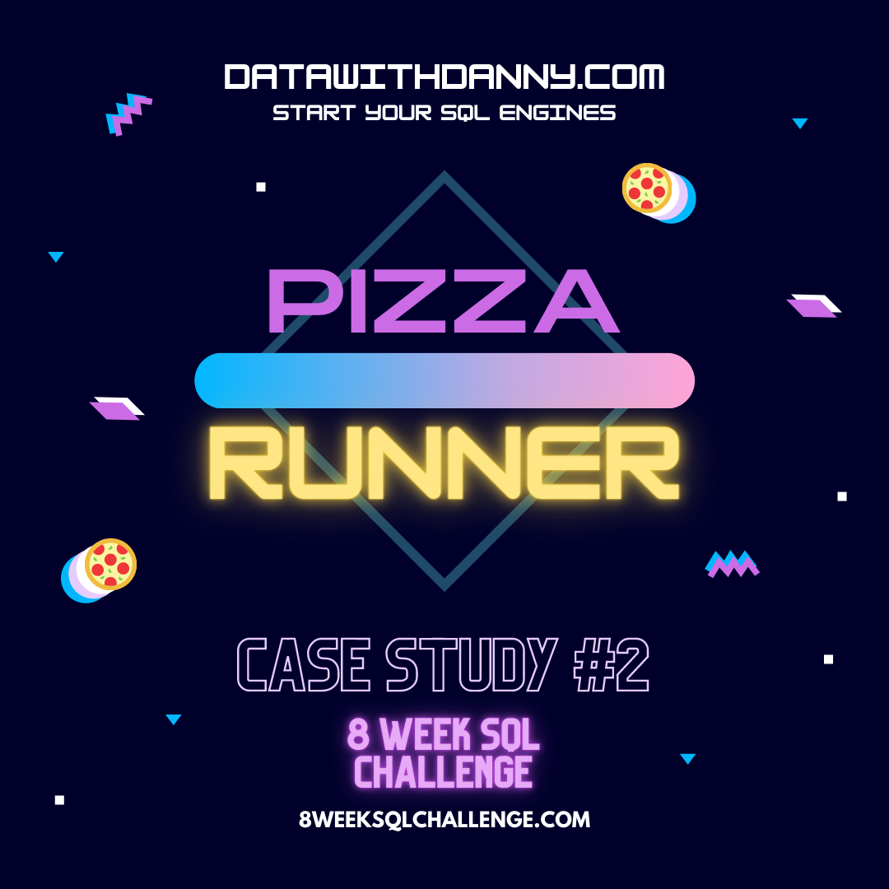
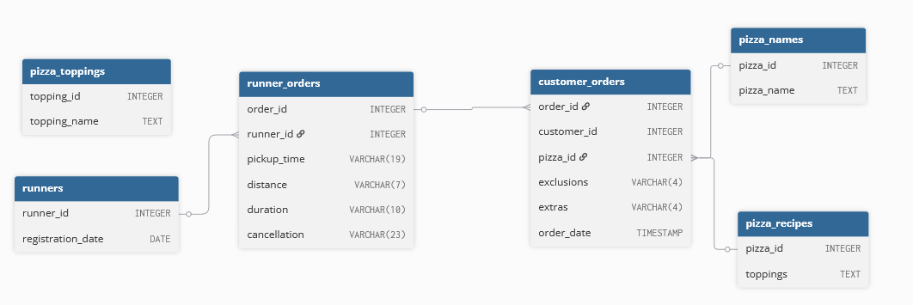

<div align="center">

# Case Study #2 - Pizza Runner </br>


</div>

## 💡 Informacje

W folderze _solutions_ znajdują się pliki z rozwiązaniami w SQL.</br>
Do wykonania wykorzystany został SQL oraz PostgreSQL.</br>
Szczegółowe informacje dotyczące tego studium przypadku znajdują się [tutaj](https://8weeksqlchallenge.com/case-study-2/).

## 📋 Spis treści

- [Opis](#opis)
- [Diagram relacji](#diagram-relacji)
- [Czyszczenie danych](#️-czyszczenie-danych)
- [Rozwiązanie zapytań: A. Pizza Metrics](#rozwiązanie-a-pizza-metrics)
  - [1. How many pizzas were ordered?](#1-how-many-pizzas-were-ordered)
  - [2. How many unique customer orders were made?](#2-how-many-unique-customer-orders-were-made)
  - [3. How many successful orders were delivered by each runner?](#3-how-many-successful-orders-were-delivered-by-each-runner)
  - [4. How many of each type of pizza was delivered?](#4how-many-of-each-type-of-pizza-was-delivered)
  - [5. How many Vegetarian and Meatlovers were ordered by each customer?](#5-how-many-vegetarian-and-meatlovers-were-ordered-by-each-customer)
  - [6. What was the maximum number of pizzas delivered in a single order?](#6-what-was-the-maximum-number-of-pizzas-delivered-in-a-single-order)
  - [7. For each customer, how many delivered pizzas had at least 1 change and how many had no changes?](#7-for-each-customer-how-many-delivered-pizzas-had-at-least-1-change-and-how-many-had-no-changes)
  - [8. How many pizzas were delivered that had both exclusions and extras?](#8-how-many-pizzas-were-delivered-that-had-both-exclusions-and-extras)
  - [9. What was the total volume of pizzas ordered for each hour of the day?](#9-what-was-the-total-volume-of-pizzas-ordered-for-each-hour-of-the-day)
  - [10. What was the volume of orders for each day of the week?](#10-what-was-the-volume-of-orders-for-each-day-of-the-week)
- [Rozwiązanie zapytań: B. Runner and Customer Experience](#rozwiązanie-zapytań)
- [Rozwiązanie zapytań: C. Ingredient Optimisation](#rozwiązanie-zapytań)
- [Rozwiązanie zapytań: D. Pricing and Ratings](#rozwiązanie-zapytań)
- [Pytania bonusowe](#pytania-dodatkowe)

## 🔍 Opis

### Wprowadzenie

Danny otworzył nowy biznes - pizzerię, ale wiedział, że sama pizza nie wystarczy, aby utworzyć swoje własne imperium pizzy, dlatego wpadł na kolejny pomysł i postanowił ją "zuberyzować" - i tak powstała Pizza Runner.

Danny zatrudnił kurierów, którzy mieli dostarczać pizzę, a także programistów, którzy stworzyli aplikację mobilną do przyjmowania zamówień od klientów.

### Problem

Danny potrzebuje pomocy w czyszczeniu danych i zastosowaniu podstawowych obliczeń, aby móc lepiej kierować prać dostawców i zoptymalizować działalność Pizza Runner.

## 📈 Diagram relacji

<div align=center>

</div>

## ⚙️ Czyszczenie danych

### Tabela: customer_orders

- W kolumnie `exclusions` oraz `extras` znajdują się brakujące wartości i wartości null jako teksty.
  Problem ten można rozwiązać na dwa sposoby:</br>

1. Zastosowanie funkcji UPDATE

```sql
UPDATE customer_orders
SET
    exclusions =
        CASE
            WHEN exclusions = '' OR exclusions = 'null' THEN NULL
            ELSE exclusions
        END,
    extras =
        CASE
            WHEN extras = '' OR extras = 'null' THEN NULL
            ELSE extras
        END;
```

Problem z tym sposobem jest taki, że raz zmienionej tabeli nie da się cofnąć i jedyną opcją jest zrobienie kopii zapasowej, dlatego jest to bardzo ryzykowna i niebezpieczna opcja przy dużych zbiorach danych.

2. Stworzenie nowej tabeli (lub tymczasowej)

```sql
CREATE TABLE customer_orders_temp AS
SELECT
    order_id,
    customer_id,
    pizza_id,
    CASE
        WHEN exclusions = '' OR exclusions = 'null' THEN NULL
        ELSE exclusions
    END AS exclusions,
    CASE
        WHEN extras = '' OR extras = 'null' THEN NULL
        ELSE extras
    END as extras,
    order_time
FROM customer_orders;
```

To rozwiązanie jest o wiele bezpieczniejsze, nie powoduje modyfikacji w danych źródłowych.

### Tabela: runner_orders

- Konwersja typów danych z kolumn: `pickup_time`, `duration`, `distance`
- Usunięcie "km" z kolumny `distance`
- Usunięcie "minutes", "mins" itp. z kolumny `duration`
- Modyfikacja brakujących wartości i niepoprawnych danych

```sql
CREATE TABLE runner_orders_temp AS
SELECT
    order_id,
    runner_id,
    CASE
        WHEN pickup_time = 'null' THEN NULL
        ELSE pickup_time
    END::TIMESTAMP as pickup_time,
    CASE
        WHEN distance = 'null' THEN NULL
        WHEN distance LIKE '%km' THEN TRIM('km' FROM distance)
        ELSE distance
    END::FLOAT as distance,
    CASE
        WHEN duration = 'null' THEN NULL
        WHEN duration LIKE '%minutes' THEN TRIM('minutes' FROM duration)
        WHEN duration LIKE '%minute' THEN TRIM('minute' FROM duration)
        WHEN duration LIKE '%mins' THEN TRIM('mins' FROM duration)
        ELSE duration
    END::INT as duration,
    CASE
        WHEN cancellation IN('null', '') THEN NULL
        ELSE cancellation
    END as cancellation
FROM runner_orders;
```

## Rozwiązanie: A. Pizza Metrics

### 1. How many pizzas were ordered?

_Jak dużo pizz zostało zamówionych?_

```sql
SELECT
    COUNT(order_id) as total_pizza
FROM customer_orders_temp;
```

#### Wynik zapytania/Odpowiedź:

| total_pizza |
| :---------: |
|     14      |

---

### 2. How many unique customer orders were made?

_Ile zostało złożonych unikalnych zamówień?_

```sql
SELECT
    COUNT(DISTINCT order_id) as unique_orders
FROM customer_orders_temp;
```

#### Proces:

- w danych powtarzają się zamówienia, dlatego zastosowano DISTINCT, aby pobrać tylko unikalne numery zamówień

#### Wynik zapytania/Odpowiedź:

| unique_orders |
| :-----------: |
|      10       |

---

### 3. How many successful orders were delivered by each runner?

_Ile pomyślnie zrealizowanych zamówień dostarczył każdy kurier?_

```sql
SELECT
    runner_id,
    COUNT(order_id) as delivered_orders
FROM runner_orders_temp
WHERE cancellation IS NULL
GROUP BY runner_id;
```

#### Proces:

Do wyodrębnienia zamówień zrealizowanych od niezrealizowanych można było użyć wiele kolumn, ja jednak wykorzystałam kolumnę `cancellation`, ponieważ ona jasno mówi czy zamówienie zostało zrealizowane czy anulowane.

#### Wynik zapytania/Odpowiedź:

| runner_id | delivered_orders |
| :-------: | :--------------: |
|     1     |        4         |
|     2     |        3         |
|     3     |        1         |

---

### 4.How many of each type of pizza was delivered?

_Ile każdego rodzaju pizzy dostało dostarczonych?_

```sql
SELECT
    pizza_name,
    COUNT(customer_orders_temp.order_id) as total_delivered
FROM customer_orders_temp
INNER JOIN pizza_names
    ON pizza_names.pizza_id = customer_orders_temp.pizza_id
INNER JOIN runner_orders_temp
    ON customer_orders_temp.order_id = runner_orders_temp.order_id
WHERE cancellation IS NULL
GROUP BY pizza_name;
```

#### Proces:

Z tablicą `customer_orders_temp` połączono tablice `pizza_names` oraz `runner_orders_temp`, aby móc uzyskać nazwy poszczególnych pizz oraz dowiedzieć się czy nie zostały anulowane.

#### Wynik zapytania/Odpowiedź:

| pizza_name | total_delivered |
| :--------: | :-------------: |
| Vegetarian |        3        |
| Meatlovers |        9        |

---

### 5. How many Vegetarian and Meatlovers were ordered by each customer?

_Ile Vegetarian i Meatlovers zostało zamówionych przez każdego klienta?_

```sql
SELECT
    customer_id,
    pizza_name,
    COUNT(order_id) as total_ordered
FROM pizza_names
INNER JOIN customer_orders_temp
    ON pizza_names.pizza_id = customer_orders_temp.pizza_id
GROUP BY customer_id, pizza_name
ORDER BY customer_id, pizza_name;
```

#### Wynik zapytania/Odpowiedź:

| customer_id | pizza_name | total_ordered |
| :---------: | :--------: | :-----------: |
|     101     | Meatlovers |       2       |
|     101     | Vegetarian |       1       |
|     102     | Meatlovers |       2       |
|     102     | Vegetarian |       1       |
|     103     | Meatlovers |       3       |
|     103     | Vegetarian |       1       |
|     104     | Meatlovers |       3       |
|     105     | Vegetarian |       1       |

---

### 6. What was the maximum number of pizzas delivered in a single order?

_Jaka była największa liczba pizz dostarczonych w ramach jednego zamówienia?_

```sql
SELECT
    c.order_id,
    COUNT(pizza_id) as pizzas
FROM customer_orders_temp as c
INNER JOIN runner_orders_temp
    ON c.order_id = runner_orders_temp.order_id
WHERE cancellation IS NULL
GROUP BY c.order_id
ORDER BY pizzas DESC LIMIT 1;
```

#### Wynik zapytania/Odpowiedź:

| order_id | pizzas |
| :------: | :----: |
|    4     |   3    |

---

### 7. For each customer, how many delivered pizzas had at least 1 change and how many had no changes?

_Dla każdego klienta, ile dostarczonych pizz miało chociaż 1 zmianę i ile nie miało żadnych zmian?_

```sql
SELECT
    customer_id,
    SUM(
        CASE
            WHEN exclusions IS NOT NULL OR extras IS NOT NULL THEN 1
            ELSE 0
        END
    ) as min_1_changes,
    SUM(
        CASE
            WHEN exclusions IS NULL AND extras IS NULL THEN 1
            ELSE 0
        END
    ) as no_changes
FROM customer_orders_temp
INNER JOIN runner_orders_temp
    ON customer_orders_temp.order_id = runner_orders_temp.order_id
WHERE cancellation IS NULL
GROUP BY customer_id
ORDER BY customer_id;
```

#### Proces

Dzięki wcześniejszemu wyczyszczeniu danych zapytanie jest krótkie i przejrzyste: w funkcji agregującej SUM() zastosowano wyrażenie CASE, której warunki definiują czy w danym zamówieniu była zmiana czy też nie.

#### Wynik zapytania/Odpowiedź:

| customer_id | min_1_changes | no_changes |
| :---------: | :-----------: | :--------: |
|     101     |       0       |     2      |
|     102     |       0       |     3      |
|     103     |       3       |     0      |
|     104     |       2       |     1      |
|     105     |       1       |     0      |

---

### 8. How many pizzas were delivered that had both exclusions and extras?

_Ile pizz dostarczono, które zawierały zarówno składniki pominięte, jak i dodatkowe?_

```sql
SELECT
    COUNT(pizza_id) as pizzas_with_exclusions_and_extras
FROM customer_orders_temp
INNER JOIN runner_orders_temp
    ON customer_orders_temp.order_id = runner_orders_temp.order_id
WHERE cancellation IS NULL AND exclusions IS NOT NULL AND extras IS NOT NULL;
```

#### Wynik zapytania/Odpowiedź:

| pizzas_with_exclusions_and_extras |
| :-------------------------------: |
|                 1                 |

---

### 9. What was the total volume of pizzas ordered for each hour of the day?

_Jaka była łączna liczba zamówionych pizz w każdej godzinie dnia?_

```sql
SELECT
    DATE_PART('hour', order_time) as hours,
    COUNT(order_id) as pizzas
FROM customer_orders_temp
GROUP BY hours
ORDER BY hours;
```

#### Proces:

Do wyciągnięcia godziny z daty potrzebna była funkcja DATEPART(), w związku z tym, że pracuję na PostgreSQL miała ona formę DATE_PART().

#### Wynik zapytania/Odpowiedź:

| hours | pizzas |
| :---: | :----: |
|  11   |   1    |
|  13   |   3    |
|  18   |   3    |
|  19   |   1    |
|  21   |   3    |
|  23   |   3    |

---

### 10. What was the volume of orders for each day of the week?

_Jaka była liczba zamówień w poszczególne dni tygodnia?_

```sql
SELECT
    TO_CHAR(order_time, 'Day') as days,
    COUNT(order_id) as orders
FROM customer_orders_temp
GROUP BY days;
```

#### Proces:

Funkcja TO_CHAR() jest funkcją, którą PostreSQL wykorzystuje do konwertowania różnych typów danych. W tym przypadku została użyta do zmiany daty w dzień tygodnia.

#### Wynik zapytania/Odpowiedź:

|   days    | orders |
| :-------: | :----: |
| Saturday  |   5    |
| Thursday  |   3    |
|  Friday   |   1    |
| Wednesday |   5    |

---

## Rozwiązanie: B. Runner and Customer Experience

### 1. How many runners signed up for each 1 week period? (i.e. week starts 2021-01-01)

_Ilu biegaczy zapisało się w każdym tygodniu? (tj. tydzień rozpoczyna się 1 stycznia 2021 r.)_

```sql
SELECT
    DATE_PART('WEEK', registration_date + INTERVAL '3 days') as week,
    COUNT(runner_id) as runners
FROM runners
GROUP BY week
ORDER BY week;
```

#### Proces:

Użyta w pytaniu A-9 funkcja DATE_PART() pozwala na wyodrębnienie numeru tygodnia z daty, jednakże w związku z tym, że 1 stycznia 2021 wypada w czwartek, funkcja automatycznie liczy ten tydzień do starego roku jako 53 tydzień, dlatego aby liczyć 1 stycznia jako pierwszy tydzień trzeba było dodać interwał przesuwajacy o 3 dni.

#### Wynik zapytania/Odpowiedź:

| week | runners |
| :--: | :-----: |
|  1   |    2    |
|  2   |    1    |
|  3   |    1    |

---

### 2. What was the average time in minutes it took for each runner to arrive at the Pizza Runner HQ to pickup the order?

_Ile minut średnio zajmowało każdemu kurierowi dotarcie do Pizza Runner w celu odebrania zamówienia?_

```sql
SELECT
    runner_id,
    DATE_PART('minute', AVG(pickup_time - order_time)) as avg_pickup_time
FROM runner_orders_temp
INNER JOIN customer_orders_temp
    ON runner_orders_temp.order_id = customer_orders_temp.order_id
WHERE pickup_time IS NOT NULL
GROUP BY runner_id
ORDER BY runner_id;
```

#### Wynik zapytania/Odpowiedź:

| runner_id | avg_pickup_time |
| :-------: | :-------------: |
|     1     |       15        |
|     2     |       23        |
|     3     |       10        |

---

### 3. Is there any relationship between the number of pizzas and how long the order takes to prepare?

_Czy istnieje jakiś związek między liczbą pizz a czasem potrzebnym na przygotowanie zamówienia?_

```sql
WITH prep_time_cte AS(
    SELECT
        customer_orders_temp.order_id,
        DATE_PART('minute', pickup_time - order_time) as prep_time,
        COUNT(pizza_id) as number_of_pizzas
    FROM customer_orders_temp
    INNER JOIN runner_orders_temp
        ON customer_orders_temp.order_id = runner_orders_temp.order_id
    WHERE pickup_time IS NOT NULL
    GROUP BY customer_orders_temp.order_id, prep_time
)

SELECT
    number_of_pizzas,
    AVG(prep_time) as avg_prep_time
FROM prep_time_cte
GROUP BY number_of_pizzas;
```

#### Wynik zapytania/Odpowiedź:

| number_of_pizzas | avg_prep_time |
| :--------------: | :-----------: |
|        3         |      29       |
|        2         |      18       |
|        1         |      12       |

---

</br></br></br></br></br></br></br></br></br></br></br></br>

### 1.

\_ \_

```sql

```

#### Proces:

#### Wynik zapytania/Odpowiedź:

#### Wytłumaczenie:

---
