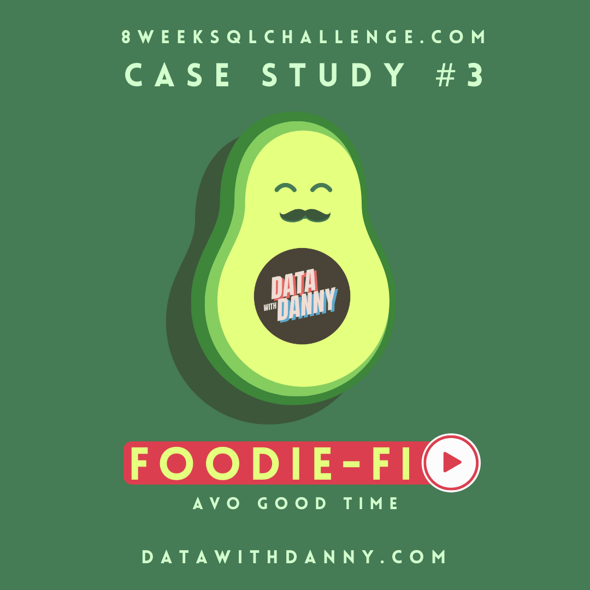
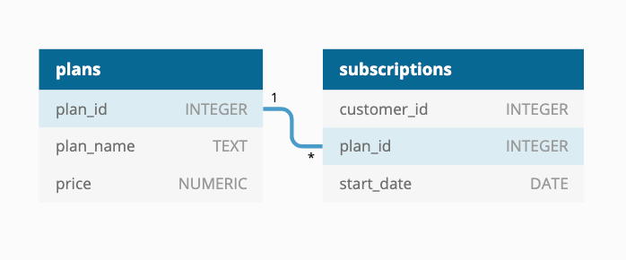

<div align="center">

# Case Study #3 - Foodie-Fi </br>


</div>

## 💡 Informacje

W folderze _solutions_ znajdują się pliki z rozwiązaniami w SQL.</br>
Do wykonania wykorzystany został SQL oraz PostgreSQL.</br>
Szczegółowe informacje dotyczące tego studium przypadku znajdują się [tutaj](https://8weeksqlchallenge.com/case-study-3/).

## 📋 Spis treści

- [Opis](#opis)
- [Diagram relacji](#diagram-relacji)
- [Rozwiązanie: A. Customer Journey](#a-customer-journey)
- [Rozwiązanie: B. Data Analysis Questions](#b-data-analysis-questions)

## 🔍 Opis

### Wprowadzenie

Danny stworzył platformę streamingową Foodie-Fi, która oferuje programy związane tylko z jedzeniem - coś jak Netflix, ale tylko z programami o gotowaniu.</br>
Platforma powstała w 2020 roku i zaoferowała miesięczne i roczne subskrypcje, dając swoim klientom nieograniczony dostęp do ekskluzywnych treści.

### Problem

Danny chce wszystkie przyszłe decyzje oprzeć na danych. To studium przypadku koncentruje się na wykorzystaniu danych cyfrowych w stylu subskrypcji, aby odpowiedzieć na ważne pytania biznesowe.

## 📈 Diagram relacji

<div align=center>

</div>

Tabela 1: plans

| plan_id |   plan_name   | price  |
| :-----: | :-----------: | :----: |
|    0    |     trial     |  0.00  |
|    1    | basic monthly |  9.90  |
|    2    |  pro monthly  | 19.90  |
|    3    |  pro annual   | 199.00 |
|    4    |     churn     |  NULL  |

Tabela 2: subscriptions

| customer_id | plan_id | start_date |
| :---------: | :-----: | :--------: |
|      1      |    0    | 2020-08-01 |
|      1      |    1    | 2020-08-08 |
|      2      |    0    | 2020-09-20 |
|      2      |    3    | 2020-09-27 |
|      3      |    0    | 2020-01-13 |

Powyżej przykładowe dane z tabeli `subscriptions`.
</br>

## A. Customer Journey

Based off the 8 sample customers provided in the sample from the subscriptions table, write a brief description about each customer’s onboarding journey.

_Na podstawie 8 przykładowych klientów z tabeli „subscriptions” napisz krótki opis ścieżki wdrożenia każdego z nich._

```sql
WITH random_id AS(
    SELECT
        customer_id
    FROM subscriptions
    GROUP BY customer_id
    ORDER BY RANDOM()
    LIMIT 8
)

SELECT
    random_id.customer_id as customer,
    plan_name,
    start_date
FROM subscriptions
INNER JOIN plans
    ON subscriptions.plan_id = plans.plan_id
INNER JOIN random_id
    ON subscriptions.customer_id = random_id.customer_id
ORDER BY customer, start_date;
```

Powyższy kod jest uniwersalny i za każdym razem wygeneruje innych 8-u klientów.

#### Przykładowy wynik zapytania:

| customer |   plan_name   | start_date |
| :------: | :-----------: | :--------: |
|    10    |     trial     | 2020-09-19 |
|    10    |  pro monthly  | 2020-09-26 |
|    20    |     trial     | 2020-04-08 |
|    20    | basic monthly | 2020-04-15 |
|    20    |  pro annual   | 2020-06-05 |
|    42    |     trial     | 2020-10-27 |
|    42    | basic monthly | 2020-11-03 |
|    42    |  pro monthly  | 2021-04-28 |
|   190    |     trial     | 2020-04-20 |
|   190    | basic monthly | 2020-04-27 |
|   190    |  pro annual   | 2020-09-04 |
|   547    |     trial     | 2020-03-05 |
|   547    | basic monthly | 2020-03-12 |
|   547    |  pro annual   | 2020-08-24 |
|   646    |     trial     | 2020-02-28 |
|   646    | basic monthly | 2020-03-06 |
|   717    |     trial     | 2020-01-08 |
|   717    |  pro monthly  | 2020-01-15 |
|   717    |  pro annual   | 2020-06-15 |
|   980    |     trial     | 2020-06-12 |
|   980    |  pro monthly  | 2020-06-19 |

#### Odpowiedź:

- Wszyscy przykładowi klienci rozpoczęli od darmowej wersji próbnej, nie od razu przeszli na płatne plany.
- W większości przypadków po okresie próbnym użytkownicy przechodzili na plan podstawowy, dopiero w późniejszym czasie ewentualnie zakupili lepsze subskrypcje. Wyjątek stanowią użytkownicy o ID 10, 717 i 980, którzy po okresie próbnym od razu przeszli na plan PRO.
- Żaden z klientów nie zmniejszył planu lub zrezygnował z subskrypcji.

---

</br>

## B. Data Analysis Questions

### 1. How many customers has Foodie-Fi ever had?

_Ilu klientów miało kiedykolwiek Foodie-Fi?_

```sql
SELECT
    COUNT(DISTINCT customer_id) as unique_customers
FROM subscriptions;
```

=

#### Wynik zapytania/Odpowiedź:

| unique_customers |
| :--------------: |
|       1000       |

---

### 2. What is the monthly distribution of trial plan start_date values for our dataset - use the start of the month as the group by value

_Jaki jest miesięczny rozkład wartości start_date planu próbnego dla naszego zestawu danych - jako wartość grupowania należy użyć początku miesiąca_

```sql
SELECT
    DATE_TRUNC('month', start_date)::DATE as start_trial,
    COUNT(customer_id) as trial_subs
FROM subscriptions
WHERE plan_id = 0
GROUP BY DATE_TRUNC('month', start_date)
ORDER BY start_trial;
```

#### Wynik zapytania/Odpowiedź:

| start_trial | trial_subs |
| :---------: | :--------: |
| 2020-01-01  |     88     |
| 2020-02-01  |     68     |
| 2020-03-01  |     94     |
| 2020-04-01  |     81     |
| 2020-05-01  |     88     |
| 2020-06-01  |     79     |
| 2020-07-01  |     89     |
| 2020-08-01  |     88     |
| 2020-09-01  |     87     |
| 2020-10-01  |     79     |
| 2020-11-01  |     75     |
| 2020-12-01  |     84     |

---

### 3. What plan start_date values occur after the year 2020 for our dataset? Show the breakdown by count of events for each plan_name

_Jakie wartości start_date występują w naszym zbiorze danych po roku 2020? Pokaż podział według liczby zdarzeń dla każdej nazwy_planu_

```sql
SELECT
    plan_name,
    COUNT(customer_id) as events_num
FROM plans
INNER JOIN subscriptions
    ON plans.plan_id = subscriptions.plan_id
WHERE start_date >= '2021-01-01'
GROUP BY plan_name;
```

#### Proces:

|   plan_name   | events_num |
| :-----------: | :--------: |
|  pro annual   |     63     |
|     churn     |     71     |
|  pro monthly  |     60     |
| basic monthly |     8      |

#### Wynik zapytania/Odpowiedź:

---

### 4. What is the customer count and percentage of customers who have churned rounded to 1 decimal place?

_Jaka jest liczba klientów i procent klientów, którzy zrezygnowali, zaokrąglona do jednego miejsca po przecinku?_

```sql
SELECT
    COUNT(DISTINCT CASE WHEN plan_id = 4 THEN customer_id END) AS churned_customers,
    ROUND(
        COUNT(DISTINCT CASE WHEN plan_id = 4 THEN customer_id END) * 100.0 / COUNT(DISTINCT customer_id), 1
        ) AS churn_percentage
FROM subscriptions;
```

#### Wynik zapytania/Odpowiedź:

| churned_customers | churn_percentage |
| :---------------: | :--------------: |
|        307        |       30.7       |

---

### 5. How many customers have churned straight after their initial free trial - what percentage is this rounded to the nearest whole number?

_Ilu klientów zrezygnowało z usług zaraz po pierwszym bezpłatnym okresie próbnym? Jaki procent tej liczby zaokrąglimy do najbliższej liczby całkowitej?_

```sql
WITH next_plan_cte AS (
  SELECT
    customer_id,
    plan_id,
    LEAD(plan_id) OVER (
      PARTITION BY customer_id
      ORDER BY plan_id
    ) as next_plan
  FROM subscriptions
)

SELECT
  COUNT(*) as churned_after_trial,
  ROUND(
    COUNT(*) * 100 / (SELECT COUNT(DISTINCT customer_id) FROM subscriptions), 0
  ) as percentage
FROM next_plan_cte
WHERE plan_id = 0 AND next_plan = 4;
```

#### Wynik zapytania/Odpowiedź:

| churned_after_tr... | percentage |
| :-----------------: | :--------: |
|         92          |     9      |

---

### 6. What is the number and percentage of customer plans after their initial free trial?

_Jaka jest liczba i procent klientów korzystających z planów po początkowym bezpłatnym okresie próbnym?
_

```sql
WITH next_plans AS (
  SELECT
    customer_id,
    plan_id,
    LEAD(plan_id) OVER (
      PARTITION BY customer_id
      ORDER BY start_date
    ) AS next_plan
  FROM subscriptions
)

SELECT
    next_plan,
    COUNT(*) AS customer_count,
    ROUND(
        COUNT(*) * 100.0 / (SELECT COUNT(DISTINCT customer_id) FROM subscriptions), 1
        ) as percentage
FROM next_plans
WHERE plan_id = 0 AND next_plan IS NOT NULL
GROUP BY next_plan
ORDER BY next_plan;
```

#### Wynik zapytania/Odpowiedź:

| next_plan | customer_count | percentage |
| :-------: | :------------: | :--------: |
|     1     |      546       |    54.6    |
|     2     |      325       |    32.5    |
|     3     |       37       |    3.7     |
|     4     |       92       |    9.2     |

---

### 7. What is the customer count and percentage breakdown of all 5 plan_name values at 2020-12-31?

_Jaka była liczba klientów i procentowy podział na wszystkie 5 planów na dzień 31.12.2020 r.?_

```sql
WITH latest_rank_cte AS(
SELECT
    customer_id,
    plan_id,
    start_date,
    RANK() OVER
    (PARTITION BY customer_id
    ORDER BY plan_id DESC) as latest_rank
FROM subscriptions
WHERE start_date <= '2020-12-31'
  )

SELECT
    plan_id,
    COUNT(customer_id) as count_customer,
    ROUND(
        COUNT(customer_id) * 100.0 / (SELECT COUNT(DISTINCT customer_id) FROM subscriptions), 1
        ) as percent
FROM latest_rank_cte
WHERE latest_rank = 1
GROUP BY plan_id
ORDER BY plan_id;
```

#### Wynik zapytania/Odpowiedź:

| plan_id | number_of_customers | percent |
| :-----: | :-----------------: | :-----: |
|    0    |         19          |   1.9   |
|    1    |         224         |  22.4   |
|    2    |         326         |  32.6   |
|    3    |         195         |  19.5   |
|    4    |         236         |  23.6   |

---

### 8. How many customers have upgraded to an annual plan in 2020?

_Ilu klientów przeszło na plan roczny w 2020 roku?_

```sql
SELECT
    COUNT(DISTINCT customer_id) as annual_customer
FROM subscriptions
WHERE start_date <= '2020-12-31'
    AND start_date >= '2020-01-01'
    AND plan_id = 3;
```

#### Wynik zapytania/Odpowiedź:

| annual_customer |
| :-------------: |
|       195       |

---

### 9. How many days on average does it take for a customer to an annual plan from the day they join Foodie-Fi?

_Ile dni średnio zajmuje klientowi przejście na plan roczny od dnia dołączenia do Foodie-Fi?_

```sql
WITH trial_date_cte as(
    SELECT
        customer_id,
        start_date as trial_date
    FROM subscriptions
    WHERE plan_id = 0
),
annual_date_cte as(
    SELECT
    customer_id,
    start_date as annual_date
FROM subscriptions
WHERE plan_id = 3
)

SELECT
    --annual_date_cte.customer_id,
    ROUND(AVG(annual_date - trial_date), 0) as avg_annual_time
FROM trial_date_cte
INNER JOIN annual_date_cte
    ON annual_date_cte.customer_id = trial_date_cte.customer_id;
```

#### Wynik zapytania/Odpowiedź:

| avg_annual_time |
| :-------------: |
|       105       |

---

### 10. Can you further breakdown this average value into 30 day periods (i.e. 0-30 days, 31-60 days etc)

_Czy możesz podzielić tę średnią wartość na okresy 30-dniowe (np. 0–30 dni, 31–60 dni itd.)?_

```sql
WITH trial_date_cte as(
-- zwraca, kiedy rozpoczęła się data okresu próbnego
    SELECT
        customer_id,
        start_date as trial_date
    FROM subscriptions
    WHERE plan_id = 0
),
annual_date_cte as(
-- zwraca, kiedy rozpoczął się plan roczny
    SELECT
    customer_id,
    start_date as annual_date
FROM subscriptions
WHERE plan_id = 3
),
intervals as(
-- podział na miesięczne przedziały
    SELECT 
        annual_date - trial_date as diff,
        WIDTH_BUCKET(annual_date - trial_date, 0, 360, 12) as avg_days_in_periods
    FROM trial_date_cte
    INNER JOIN annual_date_cte
        ON trial_date_cte.customer_id = annual_date_cte.customer_id
)

SELECT 
    CONCAT((avg_days_in_periods - 1) * 30, ' - ', avg_days_in_periods * 30, ' days') as  period,
    COUNT(*) AS total_customers,
    ROUND(AVG(diff), 2) as avg_days_to_upgrade
FROM intervals
GROUP BY avg_days_in_periods
ORDER BY avg_days_in_periods;
```

#### Proces:
Do podziału daty na przedziały 30-dniowe została użyta funkcja WIDTH_BUCKET(), do której podaje się parametry najmniejszej, największej wartości i liczba podziałów.
W głównym zapytaniu za pomocą funkcji CONCAT() połączono przedziały na łańcuch znaków.

#### Wynik zapytania/Odpowiedź:
|      period      | total_customers | avg_days_to_up... |
| :--------------: | :-------------: | :---------------: |
|   0 - 30 days    |       48        |       9.54        |
|   30 - 60 days   |       25        |       41.84       |
|   60 - 90 days   |       33        |       70.88       |
|  90 - 120 days   |       35        |       99.83       |
|  120 - 150 days  |       43        |      133.05       |
|  150 - 180 days  |       35        |      161.54       |
|  180 - 210 days  |       27        |      190.33       |
|  210 - 240 days  |        4        |      224.25       |
|  240 - 270 days  |        5        |      257.20       |
|  270 - 300 days  |        1        |      285.00       |
|  300 - 330 days  |        1        |      327.00       |
|  330 - 360 days  |        1        |      346.00       |
---

### 11. How many customers downgraded from a pro monthly to a basic monthly plan in 2020?

_Ilu klientów w 2020 roku przeszło z planu miesięcznego pro na plan miesięczny podstawowy?_

```sql
WITH next_plans_cte AS (
  SELECT
    customer_id,
    plan_id,
    LEAD(plan_id) OVER 
    (PARTITION BY customer_id
      ORDER BY start_date) as next_plan
  FROM subscriptions
  WHERE DATE_PART('year', start_date) = 2020
)

SELECT
    COUNT(*) as downgraded_customer
FROM next_plans_cte
WHERE plan_id = 2 AND next_plan = 1;
```

#### Wynik zapytania/Odpowiedź:
| downgraded_customer |
| :-----------------: |
|          0          |

#### Wytłumaczenie:
Problem z tym zapytaniem polega na tym, że w przykładowych danych podanych w zadaniu nie ma klienta, który przeszedłby na gorszy plan, dlatego aby sprawdzić poprawność dodałam wiersz, w którym klient o ID = 7 przechodzi z planu pro na basic.
---

```sql
INSERT INTO subscriptions(
    "customer_id", "plan_id", "start_date"
)
VALUES
    ('7', '1', '2020-11-01')

```
| downgraded_customer |
| :-----------------: |
|          1          |


</br></br></br></br></br></br></br></br>

### 1.

\_\_

```sql

```

#### Proces:

#### Wynik zapytania/Odpowiedź:

---
